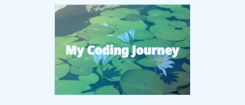

# Leoni Lubbinge's website

## Table of contents
- [Description](#description)
- [Summary](#summary)
- [Repository](#repository)
- [Structure](#structure)
- [Technology](#technology)
- [Instructions](#instructions)
- [Screenshots](#screenshots)
- [License](#license)
- [Author](#author)
- [Support](#support)

## Description
This project stores the source code for my website at https://www.tahoni.info.

## Summary
This project stores the source code for my website at https://www.tahoni.info.\
It is a React project bootstrapped using Vite with the TypeScript React template.
It is written in TypeScript and uses Bootstrap and React Bootstrap
as the UI framework.

## Repository
The repository for this project is located at
[GitHub](https://github.com/tahoni/tahoni-web-vite).

Feature requests, suggestions for improvements and bugs can be
logged using the project's 
[Issues](https://github.com/tahoni/tahoni-web-vite/issues) page.

The project can be found at [https://tahoni.info](https://www.tahoni.info).

## Structure
A high-level structure of the project.
```text
├───documentation
│   ├───manual
│   └───screenshots
├───public
└───src
    ├───assets
    │   ├───images
    │   │   └───logos
    │   └───stylesheets
    ├───components
    │   └───common
    ├───layout
    ├───model
    └───pages
```

## Technology
A list of the technology used to develop and/or run the project.

**_Languages:_**
- TypeScript 5

  [](https://www.typescriptlang.org/)

- HTML 5

  [](https://www.w3.org/)

- CSS 3

  [](https://www.w3.org/)

**_Build Tools:_**
- npm

  [](https://www.npmjs.com/)

**_Frameworks:_**
- Vite 4

  [](https://vitejs.dev/)

- React 18

  [](https://react.dev/)


**_Libraries:_**
- Bootstrap 5

  [](https://getbootstrap.com/)

- React Bootstrap 2

  [](https://react-bootstrap.github.io/)

## Instructions
In the project directory, you can run:

#### `npm run dev`
Runs the app in the development mode.\
The page will reload if you make edits.

#### `npm run build`
Builds the app for production to the `dist` folder.\
Your app is ready to be deployed!

#### `npm run preview`
Previews the app in the `dist` folder locally.\
It's an easy way to check if the production build looks OK in your local environment.

## Screenshots
_Home:_



## License
This project is licensed under the terms of the _MIT license_.

## Author
**Leoni Lubbinge**
- [](https://www.tahoni.info)
- [](mailto:leonil@tahoni.info)
- [](mailto:tahoni@outlook.com)
- [](mailto:tahoni@gmail.com)
- [](https://github.com/tahoni)
- [](https://www.linkedin.com/in/leoni-lubbinge-06066b16/)

## Support
Contributions, suggestions, bug reports and feature requests are welcome!

Give a ⭐️ if you like this project!
